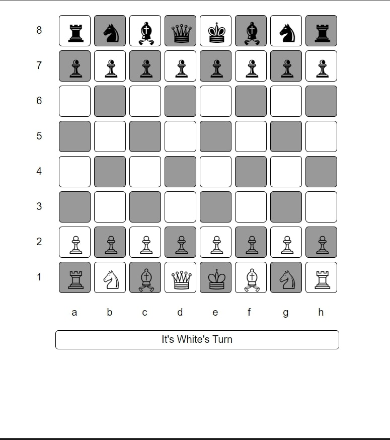

# Online Chess Platform

Welcome to our Online Chess Platform! This project allows two players to enjoy a game of chess online. Whether you're a seasoned chess player or just getting started, this platform provides a user-friendly interface for an engaging and strategic gaming experience.
Real time Chess game between two Players.

# Features

Real-time Gameplay: Enjoy a seamless chess experience with real-time updates. See your opponent's moves instantly and strategize accordingly.

Multiple Game Rooms: Create or join different game rooms. Play with friends or challenge random opponents for a quick game.

# How to Start

1. **Download Dependencies(Optional)**:

Download and include the necessary libraries and frameworks:
Chessboard.js

2. **Configure Database(Optional)**:

If using a database, set up your database and update the configuration details in the relevant script.

3. **Run the Application**:

Open the index.html file in your preferred browser to access the platform.

4. **Start Playing**:

Create or join a game room, invite friends, and start playing chess online!

# Screenshot
Here we have project screenshot :

